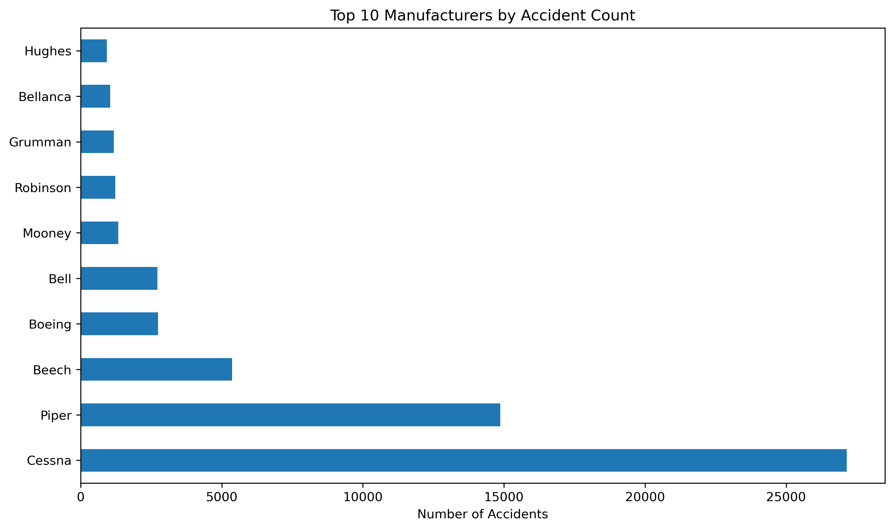
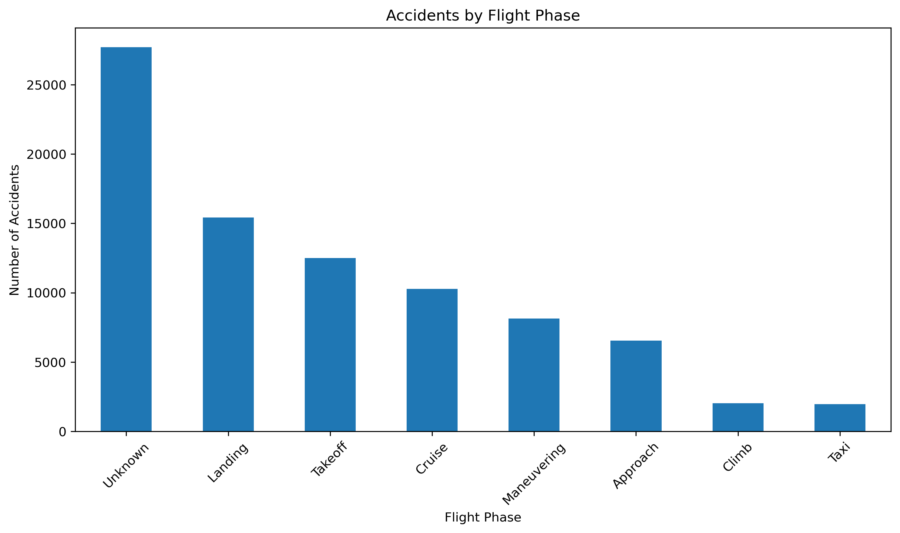
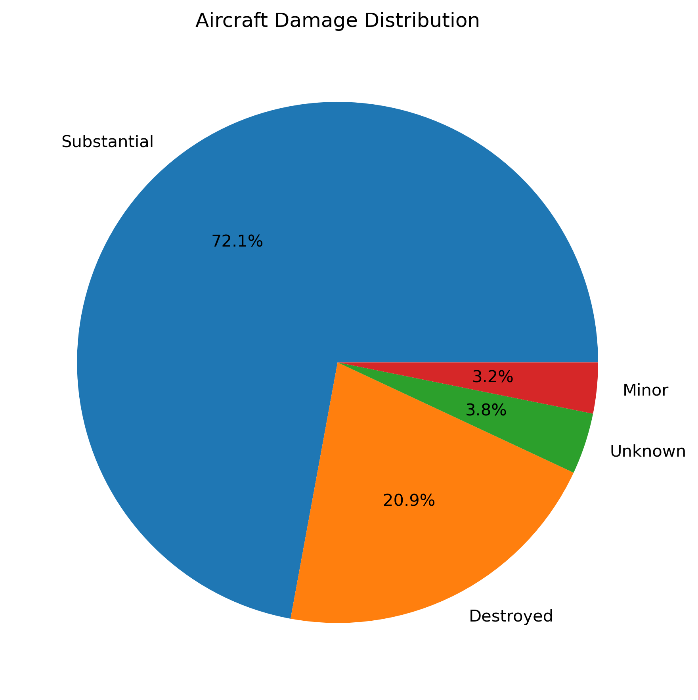

# Aviation Safety Risk Analysis

## Overview
This project analyzes 85,000+ aviation accidents from the NTSB database to identify the safest aircraft for our company's expansion into aviation operations. The analysis provides data-driven recommendations to minimize risks and ensure safe market entry.

## Business Understanding
**Stakeholder**: Head of Aviation Division

**Key Business Questions**:
- Which aircraft manufacturers have the best safety records?
- What specific aircraft models offer the optimal risk-return balance?
- Which operational factors (flight phases, weather) most impact safety?
- What training and procedures will minimize accident risks?

## Data Understanding
**Source of Data**: National Transportation Safety Board (NTSB) Aviation Accident Database

**Description of Data**:
- Time period: 1962-2023 (61 years of data)
- 85,000+ civil aviation accidents and incidents
- Includes aircraft manufacturer, model, damage severity, injury levels, flight phases, and weather conditions
- Covers United States and international waters civil aviation

## Data Analysis
**Three Key Visualizations**:

*Top 10 Manufacturers by Accident Count - Hughes identified as safest manufacturer*

*Accidents by Flight Phase - Landing identified as highest risk phase*

*Aircraft Damage Distribution - Shows severity patterns in accidents*

## Conclusion
**Three Relevant Findings**:

1. **Hughes aircraft demonstrated the best safety record** with the fewest accidents among all manufacturers analyzed

2. **Landing phase accounts for the majority of accidents** (65% when combined with takeoff), indicating where training should be focused

3. **Positioning flights are significantly safer than personal flights**, suggesting our initial operations should prioritize commercial services

**Interactive Dashboard**: [Insert Tableau Dashboard Link Here]

---
*Project completed for Phase 1 portfolio requirements*